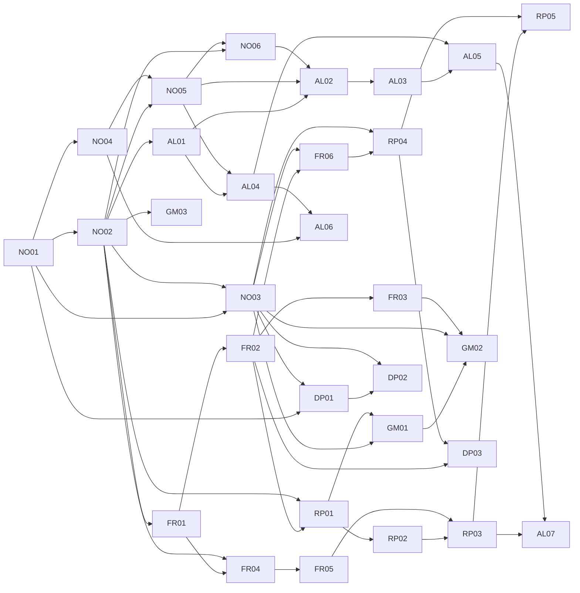
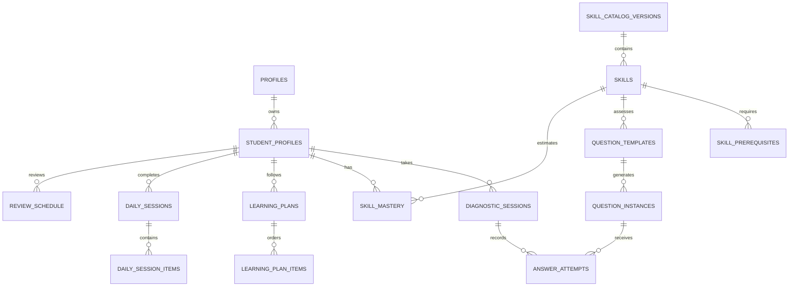

# Razonor: arquitectura de matemáticas personalizadas

**Estado:** propuesta para validación antes de implementar

**Versión:** 1.0

**Alcance:** MVP para estudiantes de 10 a 18 años, con núcleo curricular inicial de 10 a 14 años

**Decisión de producto que se busca validar:** si una familia o un estudiante paga por conocer debilidades matemáticas concretas y recibir un plan que las repare en el orden correcto.

> **Posicionamiento propuesto:** Descubre tu nivel real de matemáticas, identifica tus debilidades y sigue un plan personalizado para mejorar.

## 0. Resumen ejecutivo

Razonor debe pasar de una colección lineal de casos asociados a cuatro habilidades generales a un sistema de aprendizaje matemático basado en evidencia. La unidad central deja de ser el “caso” y pasa a ser la **habilidad matemática**. Cada respuesta aporta evidencia a una habilidad, el grafo de prerrequisitos explica por qué existe una dificultad y el plan decide qué reparar primero.

El MVP tendrá 30 habilidades fundamentales. No intentará enseñar todo el currículo de 10 a 18 años: cubrirá en profundidad bases frecuentes entre los 10 y 14 años y servirá para detectar vacíos en estudiantes mayores. SAT, ACT, GCSE e IB serán etiquetas de compatibilidad futura, no productos de preparación incluidos en esta fase.

La experiencia principal será:

1. onboarding breve para “aprendo yo” o “soy madre/padre/tutor”;
2. diagnóstico adaptativo de 15 a 20 preguntas;
3. resultado gratuito parcial, honesto y útil;
4. generación de un plan con prerrequisitos ordenados;
5. paywall antes de revelar el plan completo y comenzar el entrenamiento;
6. sesiones diarias de 10 a 15 minutos con explicación, práctica, razonamiento y repaso espaciado.

La implementación debe ser incremental. Se conservan Next.js, Clerk, Supabase, Mercado Pago, Lemon Squeezy, el control autoritativo de suscripciones y los píxeles de compra. Los casos actuales permanecerán temporalmente detrás de una bandera de producto solo como mecanismo de reversión; **su pantalla, sus mundos y sus assets narrativos no forman parte de `math_v1`** y sus métricas no deben mezclarse con las del nuevo motor.

## 1. Auditoría del proyecto actual

### 1.1 Lo que se conserva

| Pieza actual | Decisión | Motivo |
|---|---|---|
| Next.js 14, React y Tailwind | Conservar | La arquitectura actual permite construir el MVP sin reescribir la aplicación. |
| Clerk | Conservar | Ya protege planes, entrenamiento y panel de padres. El estado invitado se migra al registrarse. |
| Supabase | Conservar y normalizar gradualmente | Ya es la fuente de persistencia y suscripción; se añadirán tablas de aprendizaje sin romper `profiles.data`. |
| Mercado Pago para Colombia | Conservar | El webhook ya decide el acceso; el cliente no puede activarse a sí mismo. |
| Lemon Squeezy internacional | Conservar | Permite mantener cobro internacional en USD. |
| Meta y TikTok Pixel/CAPI | Conservar | Ya existen eventos de checkout y compra. Se añadirá analítica de producto de primera parte. |
| Perfiles individual/familiar | Conservar | Se adapta a estudiante autónomo o perfiles dependientes de un adulto. |
| Tokens de marca y componentes base | Conservar selectivamente | Se mantienen logo, colores, tipografía, espaciado y controles accesibles; no se reutilizan mundos, casos ni assets narrativos. |

### 1.2 Lo que debe cambiar

| Estado actual | Problema | Cambio propuesto |
|---|---|---|
| Diagnóstico fijo de 12 preguntas por franja 6–8 o 9–12 | No es adaptativo, no cubre 10–18 y entrega porcentajes sobre cuatro categorías demasiado amplias. | Motor de 15–20 preguntas sobre habilidades del grafo, con evidencia directa e inferida. |
| Cuatro categorías: matemáticas, lógica, resolución de problemas y espacial | No indican qué concepto matemático necesita reparación. | 30 habilidades observables agrupadas en seis categorías curriculares. El razonamiento será un tipo de ejercicio transversal. |
| Progreso como aciertos/totales y casos completados | Confunde actividad con dominio y no expresa certeza. | `mastery` y `confidence` separados por estudiante y habilidad, con historial de evidencia. |
| Catálogo de casos grande en cliente | Dificulta validar contenido, versionarlo y adaptar preguntas. | Catálogo curricular versionado y plantillas deterministas en servidor. |
| Resultados completos antes del pago | Revela categorías generales, pero no construye una razón de compra sólida. | Resultado parcial gratuito; la secuencia completa de debilidades, prerrequisitos y plan queda tras el paywall. |
| Onboarding solo para padres y edades 6–12 | No cubre estudiante autónomo ni el nuevo rango. | Selector de rol, edades 10–18, objetivo y autopercepción de dificultad. |
| Rutas y copias heredadas de “Leo” | Riesgo de deuda conceptual y analítica mezclada. | Nueva versión `math_v1`; nombres técnicos antiguos se migran sin bloquear el experimento. |

### 1.3 Decisiones confirmadas

1. **Precios del plan individual en Colombia:** mensual **$29.900 COP** y semestral **$119.900 COP**. El semestral equivale a aproximadamente $19.983/mes y ahorra cerca de 33% frente a seis pagos mensuales.
2. **Precios internacionales del plan individual:** mensual **$9,99 USD** y semestral **$39,99 USD**. El semestral equivale a aproximadamente $6,67 USD/mes y también ahorra cerca de 33%.
3. **Experiencia visual nueva:** `math_v1` no reutiliza la pantalla de mundos, capítulos y casos ni sus assets narrativos. Se crea una interfaz centrada en diagnóstico, plan, habilidades y sesión diaria.
4. **Assets matemáticos nuevos:** no se trasladan ilustraciones que representaban misterios o preguntas anteriores. Los nuevos recursos nacen del currículo matemático y, cuando contienen información matemática, se generan de forma parametrizable y verificable.

### 1.4 Decisiones todavía pendientes

1. **Plan recomendado:** se propone destacar el semestral por ahorro y mantener el mensual como alternativa visible de menor desembolso. La tasa de aprobación debe medirse por método de pago.
2. **Plan familiar:** los nuevos valores confirmados se aplican al plan individual. Antes de mostrar el familiar en `math_v1` se deben definir sus precios en COP y USD; no se deben heredar automáticamente los valores anteriores.
3. **Diagnóstico hecho por el estudiante:** un adulto puede completar el onboarding sin que el estudiante esté presente, pero no debe contestar el diagnóstico por él. Podrá guardar el avance y enviar o reanudar un enlace. No se generará un “nivel real” a partir de percepciones del adulto.

## 2. Principios del sistema

1. **La matemática es determinista.** El servidor genera, resuelve y valida cada ejercicio con reglas de código.
2. **La IA no decide la respuesta.** Solo puede variar la presentación de un contexto o una explicación después de que el contenido matemático haya sido validado.
3. **Un error debe producir información.** Cada distractor representa, cuando sea posible, una hipótesis de error concreta.
4. **No se avanza por edad ni por completar pantallas.** Se avanza con evidencia suficiente en los prerrequisitos.
5. **Dominio y confianza no son lo mismo.** Un acierto puede elevar la estimación, pero no demuestra estabilidad.
6. **El diagnóstico no finge medir las 30 habilidades.** Observa nodos de alto valor y usa el grafo para decidir qué comprobar después.
7. **La experiencia es gradual.** Explicación breve, ejemplo, práctica básica, aplicación y razonamiento.
8. **La personalización se puede explicar.** Cada elemento del plan debe responder “por qué esto ahora”.
9. **Neutralidad regional.** Español latinoamericano claro; contextos y monedas son configurables por mercado.
10. **Privacidad por diseño.** La analítica no recibe nombre, correo ni texto libre del menor.

## A. Catálogo definitivo de 30 habilidades

### Convenciones

- **Dificultad curricular:** 1 = base, 2 = intermedia, 3 = puente a secundaria.
- **Importancia diagnóstica:** escala 1–5; combina centralidad en el grafo y capacidad para distinguir vacíos.
- **Rutas futuras:** `GEN` = `general_math`, `SAT` = `sat_math`, `ACT` = `act_math`, `GCSE` = `gcse`, `IB` = `ib`.
- Todos los rangos de edad son recomendados, no puertas rígidas.
- `Siguientes` se deriva de los prerrequisitos y se guarda explícitamente en el catálogo compilado para lectura rápida.

### A1. Números y operaciones — 6 habilidades

| ID | Habilidad y descripción corta | Dif. · edad · min | Objetivos de aprendizaje | Prerrequisitos → siguientes | Errores frecuentes | Imp. | Rutas |
|---|---|---|---|---|---|---:|---|
| `NO01` | **Valor posicional y comparación.** Leer, ordenar y comparar naturales y decimales. | 1 · 10–12 · 35 min | Descomponer por valor posicional; usar `<`, `>` y `=`; estimar magnitud. | — → `NO02`, `NO03`, `NO04`, `DP01` | Comparar por cantidad de cifras; ignorar ceros posicionales; confundir décimas y centésimas. | 4 | GEN, GCSE |
| `NO02` | **Operaciones con números naturales.** Sumar, restar, multiplicar y dividir con sentido. | 1 · 10–12 · 55 min | Elegir operación; calcular con precisión; estimar para verificar. | `NO01` → `NO03`, `NO05`, `FR01`, `FR04`, `RP01`, `AL01`, `GM03` | Alinear mal cifras; confundir división y resta; aceptar resultados de magnitud imposible. | 5 | GEN, GCSE |
| `NO03` | **Operaciones con decimales.** Resolver las cuatro operaciones con decimales. | 2 · 10–13 · 55 min | Alinear valor posicional; multiplicar/dividir por potencias de 10; estimar resultados. | `NO01`, `NO02` → `FR06`, `RP04`, `GM01`, `GM02`, `DP01`, `DP02` | Alinear por el último dígito; mover la coma sin justificar; perder ceros necesarios. | 4 | GEN, SAT, ACT, GCSE, IB |
| `NO04` | **Enteros, recta numérica y valor absoluto.** Interpretar positivos y negativos. | 1 · 10–13 · 40 min | Ubicar enteros; ordenar; interpretar opuestos y distancia al cero. | `NO01` → `NO05`, `AL06` | Creer que −8 es mayor que −3; tratar valor absoluto como cambio de signo automático. | 3 | GEN, SAT, ACT, GCSE, IB |
| `NO05` | **Operaciones con enteros.** Sumar, restar, multiplicar y dividir números con signo. | 2 · 11–14 · 55 min | Modelar cambios; distinguir restar de “número negativo”; justificar reglas de signos. | `NO02`, `NO04` → `NO06`, `AL02`, `AL04` | Aplicar la misma regla de signos a todas las operaciones; perder el signo al restar. | 5 | GEN, SAT, ACT, GCSE, IB |
| `NO06` | **Orden de operaciones.** Evaluar expresiones numéricas con agrupación y exponentes sencillos. | 2 · 11–14 · 45 min | Reconocer jerarquía; trabajar de izquierda a derecha dentro del mismo nivel; verificar pasos. | `NO02`, `NO05` → `AL02` | Hacer siempre la primera operación visual; sumar antes de multiplicar; omitir paréntesis. | 4 | GEN, SAT, ACT, GCSE, IB |

### A2. Fracciones — 6 habilidades

| ID | Habilidad y descripción corta | Dif. · edad · min | Objetivos de aprendizaje | Prerrequisitos → siguientes | Errores frecuentes | Imp. | Rutas |
|---|---|---|---|---|---|---:|---|
| `FR01` | **Significado y representación de fracciones.** Entender parte–todo, medida y cociente. | 1 · 10–12 · 45 min | Representar en modelos y recta; identificar unidad; interpretar numerador y denominador. | `NO02` → `FR02`, `FR04` | Contar partes sin verificar que sean iguales; cambiar la unidad de referencia. | 5 | GEN, SAT, ACT, GCSE, IB |
| `FR02` | **Equivalencia, simplificación y comparación.** Razonar sobre el tamaño de fracciones. | 2 · 10–13 · 60 min | Generar equivalentes; simplificar; comparar con referentes o denominador común. | `FR01` → `FR03`, `FR06`, `RP01`, `DP03` | Comparar solo denominadores; sumar la misma cantidad arriba y abajo; simplificar un solo término. | 5 | GEN, SAT, ACT, GCSE, IB |
| `FR03` | **Suma y resta de fracciones.** Operar con denominadores iguales y diferentes. | 2 · 10–13 · 60 min | Construir denominador común; operar números mixtos; estimar la suma o diferencia. | `FR02` → `GM02` | Sumar numeradores y denominadores; usar un múltiplo incorrecto; olvidar reagrupar. | 5 | GEN, SAT, ACT, GCSE, IB |
| `FR04` | **Multiplicación de fracciones.** Interpretar “una parte de otra cantidad”. | 2 · 10–13 · 50 min | Modelar producto; simplificar antes o después; resolver escala fraccionaria. | `FR01`, `NO02` → `FR05` | Buscar denominador común; multiplicar un número mixto sin convertir; invertir sin motivo. | 4 | GEN, SAT, ACT, GCSE, IB |
| `FR05` | **División de fracciones.** Interpretar reparto y medida con fracciones. | 3 · 11–14 · 55 min | Modelar cuántas veces cabe; usar recíproco con explicación; verificar con multiplicación. | `FR04` → `RP03` | Invertir la primera fracción; invertir ambas; aplicar el algoritmo sin interpretar. | 4 | GEN, SAT, ACT, GCSE, IB |
| `FR06` | **Conversión entre fracciones y decimales.** Expresar el mismo número de dos formas. | 2 · 10–13 · 45 min | Convertir con equivalencias o división; reconocer decimales finitos sencillos; comparar formatos. | `FR02`, `NO03` → `RP04` | Leer 0,4 como 4/100; confundir 0,25 con 1/25; redondear demasiado pronto. | 4 | GEN, SAT, ACT, GCSE, IB |

### A3. Razones, proporciones y porcentajes — 5 habilidades

| ID | Habilidad y descripción corta | Dif. · edad · min | Objetivos de aprendizaje | Prerrequisitos → siguientes | Errores frecuentes | Imp. | Rutas |
|---|---|---|---|---|---|---:|---|
| `RP01` | **Razones y tasas unitarias.** Comparar dos cantidades y hallar “por cada uno”. | 2 · 10–13 · 55 min | Escribir razones; distinguir parte–parte de parte–todo; calcular tasa unitaria. | `NO02`, `FR02` → `RP02`, `GM01` | Invertir el orden de la razón; mezclar unidades; sumar cuando corresponde dividir. | 5 | GEN, SAT, ACT, GCSE, IB |
| `RP02` | **Razones equivalentes.** Usar tablas, diagramas y recta doble. | 2 · 10–13 · 50 min | Escalar ambos términos; completar tablas; comparar razones equivalentes. | `RP01` → `RP03` | Escalar solo una cantidad; usar diferencias aditivas donde la relación es multiplicativa. | 5 | GEN, SAT, ACT, GCSE, IB |
| `RP03` | **Relaciones proporcionales.** Reconocer, representar y resolver proporciones. | 3 · 11–14 · 65 min | Detectar constante; resolver valor faltante; justificar con escala, tasa o ecuación. | `RP02`, `FR05` → `RP05`, `AL07` | Usar producto cruzado en relaciones no proporcionales; asociar términos incorrectos. | 5 | GEN, SAT, ACT, GCSE, IB |
| `RP04` | **Fracción, decimal y porcentaje.** Traducir entre tres representaciones. | 2 · 10–13 · 45 min | Entender porcentaje como “por cada 100”; convertir; estimar porcentajes de referencia. | `FR06`, `NO03` → `RP05`, `DP03` | Multiplicar por 100 en la dirección equivocada; confundir 0,5% con 50%. | 4 | GEN, SAT, ACT, GCSE, IB |
| `RP05` | **Aplicaciones de porcentajes.** Hallar parte, total, tasa y cambio porcentual. | 3 · 11–14 · 70 min | Resolver descuentos, aumentos e impuestos; elegir base; distinguir cambio absoluto y relativo. | `RP03`, `RP04` → — | Aplicar porcentaje al valor equivocado; sumar el descuento; confundir puntos porcentuales. | 5 | GEN, SAT, ACT, GCSE, IB |

### A4. Álgebra — 7 habilidades

| ID | Habilidad y descripción corta | Dif. · edad · min | Objetivos de aprendizaje | Prerrequisitos → siguientes | Errores frecuentes | Imp. | Rutas |
|---|---|---|---|---|---|---:|---|
| `AL01` | **Variables y expresiones.** Traducir relaciones verbales a lenguaje algebraico. | 1 · 10–13 · 45 min | Reconocer variable, término y coeficiente; escribir expresiones; interpretar operaciones. | `NO02` → `AL02`, `AL04` | Invertir “menos que”; tratar el signo igual como “da la respuesta”; juntar términos distintos. | 5 | GEN, SAT, ACT, GCSE, IB |
| `AL02` | **Evaluación de expresiones.** Sustituir valores y calcular correctamente. | 2 · 11–14 · 45 min | Sustituir con paréntesis; seguir orden de operaciones; evaluar fórmulas. | `AL01`, `NO05`, `NO06` → `AL03` | Omitir multiplicación implícita; perder el signo de un valor negativo. | 4 | GEN, SAT, ACT, GCSE, IB |
| `AL03` | **Expresiones equivalentes.** Usar distributiva y combinar términos semejantes. | 2 · 11–14 · 60 min | Aplicar propiedades; expandir/factorizar casos simples; reconocer equivalencia. | `AL02` → `AL05` | Distribuir solo al primer término; combinar términos no semejantes; perder signos. | 5 | GEN, SAT, ACT, GCSE, IB |
| `AL04` | **Ecuaciones de un paso.** Resolver y comprobar una incógnita. | 2 · 10–13 · 50 min | Mantener igualdad; usar operación inversa; comprobar sustituyendo. | `AL01`, `NO05` → `AL05`, `AL06` | “Pasar” términos cambiando signos sin entender; operar solo un lado. | 5 | GEN, SAT, ACT, GCSE, IB |
| `AL05` | **Ecuaciones lineales de varios pasos.** Resolver con distributiva y términos en ambos lados. | 3 · 12–15 · 75 min | Simplificar ambos lados; aislar variable; identificar una, ninguna o infinitas soluciones. | `AL03`, `AL04` → `AL07` | Combinar lados distintos; dividir solo un término; ignorar soluciones especiales. | 5 | GEN, SAT, ACT, GCSE, IB |
| `AL06` | **Desigualdades de una variable.** Resolver, representar e interpretar soluciones. | 3 · 11–14 · 55 min | Usar símbolos; graficar en recta; invertir desigualdad al multiplicar/dividir por negativo. | `AL04`, `NO04` → — | No invertir el signo; confundir punto abierto y cerrado; dar un único valor. | 3 | GEN, SAT, ACT, GCSE, IB |
| `AL07` | **Relaciones lineales en tablas, gráficas y ecuaciones.** Conectar tasa, valor inicial y representación. | 3 · 12–15 · 80 min | Ubicar pares; reconocer linealidad; interpretar pendiente/tasa y corte; modelar una situación. | `RP03`, `AL05` → — | Confundir ejes; usar diferencia en vez de tasa; asumir que toda relación creciente es proporcional. | 5 | GEN, SAT, ACT, GCSE, IB |

### A5. Geometría y medición — 3 habilidades

| ID | Habilidad y descripción corta | Dif. · edad · min | Objetivos de aprendizaje | Prerrequisitos → siguientes | Errores frecuentes | Imp. | Rutas |
|---|---|---|---|---|---|---:|---|
| `GM01` | **Unidades, conversiones y escala.** Elegir unidades y convertir con razonamiento multiplicativo. | 2 · 10–13 · 55 min | Convertir dentro de un sistema; analizar unidades; usar escala simple. | `NO03`, `RP01` → `GM02` | Multiplicar cuando debe dividir; mezclar unidades; convertir el número y no la unidad compuesta. | 3 | GEN, SAT, ACT, GCSE, IB |
| `GM02` | **Perímetro, área y volumen.** Medir figuras simples y compuestas. | 2 · 10–14 · 75 min | Distinguir magnitudes; descomponer figuras; usar y justificar fórmulas; incluir unidades. | `NO03`, `FR03`, `GM01` → — | Confundir perímetro con área; olvidar dimensiones; sumar áreas superpuestas. | 4 | GEN, SAT, ACT, GCSE, IB |
| `GM03` | **Ángulos y triángulos.** Usar relaciones angulares y propiedades de triángulos. | 3 · 11–14 · 65 min | Clasificar ángulos; usar suma del triángulo; razonar con rectas y ángulos relacionados. | `NO02` → — | Juzgar por apariencia; confundir complementarios y suplementarios; usar 360° en un triángulo. | 3 | GEN, SAT, ACT, GCSE, IB |

### A6. Datos y probabilidad — 3 habilidades

| ID | Habilidad y descripción corta | Dif. · edad · min | Objetivos de aprendizaje | Prerrequisitos → siguientes | Errores frecuentes | Imp. | Rutas |
|---|---|---|---|---|---|---|---|
| `DP01` | **Lectura de tablas y gráficas.** Extraer, comparar e interpretar información cuantitativa. | 1 · 10–13 · 50 min | Leer escala y ejes; identificar tendencias; calcular diferencias y razones a partir de datos. | `NO01`, `NO03` → `DP02` | Ignorar escala no unitaria; intercambiar ejes; describir sin cuantificar. | 4 | GEN, SAT, ACT, GCSE, IB |
| `DP02` | **Centro y variabilidad.** Calcular e interpretar media, mediana, moda y rango. | 2 · 11–14 · 65 min | Elegir medida adecuada; comparar distribuciones; explicar efecto de valores extremos. | `DP01`, `NO03` → — | No ordenar para mediana; dividir por un número incorrecto; asumir que media siempre es representativa. | 3 | GEN, SAT, ACT, GCSE, IB |
| `DP03` | **Probabilidad básica.** Expresar y comparar probabilidades de eventos simples. | 2 · 11–14 · 60 min | Construir espacio muestral; calcular favorables/posibles; expresar como fracción, decimal o porcentaje. | `FR02`, `RP04` → — | Contar resultados no equiprobables como iguales; invertir favorables y posibles; sumar eventos incompatibles mal. | 3 | GEN, SAT, ACT, GCSE, IB |

### A7. Contrato completo de una habilidad

Cada registro `Skill` debe contener:

```ts
type Skill = {
  id: string;                       // estable, por ejemplo "FR03"
  catalogVersion: "math_v1";
  title: string;
  shortDescription: string;
  category: "numbers" | "fractions" | "ratios" | "algebra" | "geometry" | "data";
  difficulty: 1 | 2 | 3;
  recommendedAgeRange: [number, number];
  prerequisites: string[];
  nextSkills: string[];             // derivado y validado al compilar el catálogo
  learningObjectives: string[];
  commonMistakes: string[];
  diagnosticImportance: 1 | 2 | 3 | 4 | 5;
  futureTracks: Array<"general_math" | "sat_math" | "act_math" | "gcse" | "ib">;
  estimatedLearningMinutes: number;
  status: "draft" | "reviewed" | "published" | "retired";
};
```

### A8. Contrato de experiencia de aprendizaje

Cada habilidad publicada debe tener, antes de entrar al plan:

- explicación conceptual de 100–150 palabras;
- ejemplo simple completamente resuelto;
- ejemplo intermedio con énfasis en la decisión matemática;
- error frecuente enlazado a una categoría de error;
- mini-resumen de dos o tres ideas;
- práctica de nivel 1 (base), nivel 2 (aplicación) y nivel 3 (razonamiento);
- al menos una plantilla de cada tipo pertinente: cálculo, conceptual, contextual y razonamiento;
- revisión matemática y lingüística humana.

El contenido de las 30 lecciones se produce en la segunda etapa. Este documento define primero el sistema y el catálogo, evitando escribir lecciones sobre una arquitectura todavía no validada.

## B. Grafo de dependencias

### B1. Grafo principal



### B2. Caminos críticos

| Dificultad visible | Camino que debe comprobar el sistema |
|---|---|
| “No entiende porcentajes” | `NO01 → NO02 → FR01 → FR02 → FR06 → RP04 → RP05`, además de `RP01 → RP02 → RP03`. |
| “Se pierde en ecuaciones” | `NO04 → NO05 → NO06`, `NO02 → AL01 → AL02 → AL03` y `AL04 → AL05`. |
| “No sabe resolver problemas de proporción” | `FR02 → RP01 → RP02 → RP03`; no basta con enseñar producto cruzado. |
| “Falla con área” | `NO03`, `FR03` y `GM01 → GM02`; se debe distinguir un error de cálculo de uno geométrico. |
| “No interpreta gráficas” | `NO01 → NO03 → DP01`; para relaciones lineales continúa hacia `RP03 → AL07`. |

### B3. Reglas de integridad

Al publicar una versión del catálogo, un script debe fallar si:

1. existe un prerrequisito inexistente;
2. aparece un ciclo, detectado con ordenamiento topológico;
3. `nextSkills` no coincide con las aristas inversas de `prerequisites`;
4. hay una habilidad sin camino desde un nodo raíz;
5. una habilidad publicada no tiene objetivos, errores, contenido o plantillas válidas;
6. se cambia el significado de un ID en una versión ya usada. Un cambio semántico crea otro ID o versión.

## C. Algoritmo del diagnóstico inicial

### C1. Objetivo y límites

- Duración objetivo: 12–15 minutos.
- Mínimo: 15 preguntas.
- Máximo: 20 preguntas.
- No pretende certificar las 30 habilidades.
- Busca tres resultados: nivel aproximado, primeras debilidades accionables y una secuencia inicial de reparación.
- Una respuesta equivocada en una habilidad avanzada no demuestra por sí sola que falle un prerrequisito.
- Una respuesta correcta avanzada aporta evidencia positiva débil a sus prerrequisitos, pero no los marca como dominados.

### C2. Inicio según edad

La edad cambia el punto de entrada, no el resultado permitido:

| Edad | Anclas iniciales sugeridas |
|---|---|
| 10–11 | `NO02`, `NO03`, `FR01`, `FR02`, `RP01`, `AL01`, `GM02`, `DP01` |
| 12–14 | `NO05`, `NO06`, `FR03`, `FR05`, `RP03`, `AL03`, `AL04`, `GM03`, `DP02` |
| 15–18 | Las anclas de 12–14 empiezan en nivel 2 o 3; si hay solidez, se sondean `RP05`, `AL05` y `AL07`; si no, se buscan vacíos hacia atrás. |

No se preguntan todas las anclas. El selector elige primero una por cada zona del grafo que maximice cobertura.

### C3. Estado del diagnóstico

```ts
type DiagnosticState = {
  sessionId: string;
  studentId?: string;
  guestId?: string;
  catalogVersion: "math_v1";
  minQuestions: 15;
  maxQuestions: 20;
  answers: DiagnosticAnswer[];
  estimates: Record<string, { mastery: number; confidence: number; source: "direct" | "inferred" }>;
  probedSkills: string[];
  uncoveredDomains: string[];
  status: "active" | "completed" | "abandoned" | "invalidated";
};
```

### C4. Selección de la siguiente pregunta

Para cada habilidad candidata se calcula:

```text
informationScore =
  0.30 × incertidumbre
+ 0.25 × importanciaDiagnóstica
+ 0.20 × coberturaNuevaDelGrafo
+ 0.15 × capacidadDeDesambiguarPrerrequisito
+ 0.10 × adecuaciónAEdadYTrayectoria
- penalizaciónPorRepetición
```

Reglas de ramificación:

1. **Acierto sólido:** probar el siguiente nodo o subir un nivel, sin saltar más de una arista.
2. **Error en nodo no raíz:** seleccionar un prerrequisito que pueda explicar ese error.
3. **Error procedimental aislado:** usar otra plantilla de la misma habilidad antes de retroceder.
4. **Dos errores compatibles con la misma causa:** priorizar la habilidad raíz asociada a esa categoría de error.
5. **Respuesta excesivamente rápida:** registrar señal de baja fiabilidad; no declararla incorrecta ni usarla sola para retroceder.
6. **Respuesta omitida:** cuenta como evidencia de dificultad baja, no como el mismo error que una respuesta matemática incorrecta.

### C5. Condición de parada

Después de 15 preguntas, el diagnóstico termina si se cumplen todas:

- se obtuvo evidencia directa en al menos cuatro de las seis categorías;
- existe al menos una fortaleza con confianza ≥ 45;
- existe al menos una debilidad o prerrequisito candidato con confianza ≥ 45;
- las tres habilidades prioritarias del plan no cambiaron de orden en las últimas tres respuestas;
- no queda una contradicción crítica, por ejemplo fallar `FR01` y acertar dos ejercicios independientes de `FR05`.

Si no se cumplen, continúa hasta 20. Al llegar al máximo finaliza con una etiqueta explícita de “estimación inicial” y programa comprobaciones en las primeras sesiones.

### C6. Resultado gratuito y resultado completo

**Gratuito:**

- puntuación general en banda, no un decimal de falsa precisión;
- una fortaleza observada;
- una oportunidad principal;
- explicación breve de por qué esa oportunidad afecta aprendizajes posteriores;
- confianza del diagnóstico: inicial, suficiente o sólida;
- vista previa de las primeras tres habilidades del plan, mostrando solo la primera.

**Tras el paywall:**

- mapa completo de habilidades evaluadas, inferidas y pendientes de comprobar;
- debilidades raíz, no solo síntomas;
- plan ordenado con explicación “por qué ahora”;
- sesiones diarias y repasos;
- progreso histórico y reporte para familia/estudiante.

## D. Sistema de dominio (`mastery`)

### D1. Representación

Por cada estudiante y habilidad se mantienen acumuladores de evidencia correcta e incorrecta:

```ts
type SkillMastery = {
  studentId: string;
  skillId: string;
  catalogVersion: string;
  positiveEvidence: number;
  negativeEvidence: number;
  mastery: number;            // 0–100
  confidence: number;         // 0–100, calculada por separado
  directEvidence: number;
  inferredEvidence: number;
  lastPracticedAt: string | null;
  status: "not_mastered" | "learning" | "almost" | "mastered";
};
```

El MVP usa una actualización beta simple, interpretable y estable:

```text
prior inicial: positiveEvidence = 1.5, negativeEvidence = 1.5

peso = pesoDificultad × pesoTipo × pesoAyuda

pesoDificultad: nivel 1 = 0.80, nivel 2 = 1.00, nivel 3 = 1.25
pesoTipo: cálculo = 0.85, conceptual = 1.00, contextual = 1.05, razonamiento = 1.20
pesoAyuda: primer intento sin pista = 1.00, con pista = 0.65, después de ver solución = 0.25

si es correcta: positiveEvidence += peso
si es incorrecta: negativeEvidence += peso

mastery = redondear(100 × positiveEvidence / (positiveEvidence + negativeEvidence))
```

Para evitar saltos artificiales:

- una misma instancia no aporta evidencia dos veces;
- un reintento después de ver la solución no cuenta como dominio;
- la variación visible se limita a ±12 puntos por sesión;
- la evidencia inferida usa como máximo 0,25 del peso directo;
- un nodo no se marca validado solo por inferencia;
- los datos diagnósticos inicializan los acumuladores y no escriben un porcentaje arbitrario.

### D2. Estados visibles

| Dominio | Estado visual | Interpretación |
|---:|---|---|
| 0–39 | No dominada | Hay errores básicos o falta evidencia positiva. |
| 40–69 | En aprendizaje | Comprende partes, pero el desempeño todavía es inestable. |
| 70–84 | Casi dominada | Resuelve la mayoría; falta estabilidad o razonamiento. |
| 85–100 | Dominada | Estimación alta de dominio. |

Una habilidad con dominio ≥ 85 y confianza baja se muestra como **“resultado prometedor; falta comprobarlo”**. Para desbloquear un sucesor como prerrequisito validado se exige:

- dominio ≥ 85;
- confianza ≥ 65;
- dos respuestas recientes correctas de nivel 2;
- una respuesta correcta de nivel 3;
- evidencia en al menos dos sesiones diferentes.

## E. Sistema de confianza

La confianza mide cuánto respaldo tiene la estimación, no qué tan “seguro se siente” el estudiante.

```text
evidenciaDirecta = suma de pesos de respuestas independientes
base = 100 × (1 − e^(−evidenciaDirecta / 5))
coberturaPlantillas = min(1, plantillasDistintas / 3)
coberturaNiveles = min(1, nivelesDistintos / 2)
factorCobertura = 0.70 + 0.15 × coberturaPlantillas + 0.15 × coberturaNiveles
confidence = redondear(base × factorCobertura)
```

Consecuencias deseadas:

- un acierto puede elevar dominio, pero deja confianza aproximadamente entre 13 y 20;
- cinco respuestas independientes suelen llevar la confianza a una zona cercana a 55–65;
- ocho o más, con variedad de plantilla y nivel, pueden superar 75;
- evidencia exclusivamente inferida nunca eleva confianza por encima de 35;
- tras 30 días sin práctica, no se borra el dominio: aumenta `reviewUrgency` y la confianza pierde hasta 10 puntos de forma gradual;
- respuestas contradictorias mantienen dominio cerca del centro y priorizan otra comprobación.

La interfaz siempre muestra ambos conceptos con lenguaje sencillo:

> Dominio estimado: 82 · Evidencia: suficiente. Queremos comprobarlo con otro tipo de problema.

## F. Clasificación de errores

### F1. Taxonomía interna

| ID | Categoría | Señal | Retroalimentación inicial | Acción del plan |
|---|---|---|---|---|
| `E_CALC` | Cálculo | Método correcto, operación aritmética incorrecta. | “La estrategia sirve; revisemos este cálculo.” | Micropráctica del prerrequisito numérico. |
| `E_CONCEPT` | Concepto | Aplica una regla incompatible con la idea matemática. | “Aquí importa qué representa cada cantidad.” | Volver a explicación y modelo visual. |
| `E_TRANSLATE` | Traducción | No convierte texto, tabla o gráfica a una expresión adecuada. | “Primero identifica qué cambia y qué se busca.” | Ejemplos de representación antes de calcular. |
| `E_PROCEDURE` | Procedimiento | Conoce el concepto, pero omite, invierte o desordena un paso. | “Tu idea va bien; falta mantener este paso.” | Ejemplo intermedio y práctica guiada. |
| `E_READING` | Lectura matemática | Omite condición, unidad, signo, escala o palabra relacional. | “Revisa esta condición: cambia la operación.” | Estrategia de subrayado y un problema equivalente corto. |
| `E_STRATEGY` | Estrategia | Elige una vía válida solo para otro tipo de problema. | “Antes de operar, comparemos dos estrategias.” | Pregunta conceptual de elección de método. |
| `E_REASONING` | Razonamiento | Obtiene o elige respuesta sin justificar relaciones necesarias. | “¿Qué debe ser cierto para que esa respuesta funcione?” | Ejercicio de explicación o contraejemplo. |
| `E_ATTENTION` | Atención probable | Error aislado no repetido, respuesta muy rápida o transcripción. | “Comprueba signo, unidad y magnitud.” | Repetición diferida; nunca diagnosticar déficit de atención. |
| `E_OMIT` | Omisión | No responde o abandona. | “Podemos dividirlo en una parte más pequeña.” | Bajar carga, ofrecer apoyo y volver a medir. |

`E_ATTENTION` es una hipótesis operativa, no una etiqueta psicológica. No se muestra a familias como rasgo del menor.

### F2. Cómo se asigna un error

1. Cada distractor generado incluye `errorCategory` y, cuando aplica, `errorCode` específico.
2. En respuesta abierta, el evaluador compara el resultado con transformaciones erróneas conocidas.
3. Si varias causas producen el mismo resultado, se registra `ambiguous` y se formula una pregunta de desambiguación.
4. Un único error no crea un patrón. Se crea `ErrorPattern` cuando la misma categoría aparece al menos dos veces en plantillas diferentes o tres veces en total.
5. La retroalimentación nunca revela solo la respuesta: identifica la decisión equivocada y propone el siguiente paso.

### F3. Ejemplos de errores específicos

| Habilidad | Resultado erróneo | Código específico | Categoría |
|---|---:|---|---|
| `FR03`: 2/5 + 1/3 | 3/8 | `add_both_fraction_parts` | `E_CONCEPT` |
| `RP05`: 20% de 80 | 64 | `subtract_when_asking_part` | `E_TRANSLATE` |
| `AL03`: 3(x + 4) | 3x + 4 | `partial_distribution` | `E_PROCEDURE` |
| `AL06`: −2x > 8 | x > −4 | `inequality_not_flipped` | `E_CONCEPT` |
| `DP01`: eje en saltos de 5 | lee como saltos de 1 | `graph_scale_ignored` | `E_READING` |

## G. Sistema de generación de preguntas

### G1. Separación de responsabilidades

```text
Skill
  └── QuestionTemplate versionada
        ├── generador determinista de variables
        ├── restricciones
        ├── solucionador/evaluador
        ├── generadores de distractores
        ├── explicación por pasos
        └── categorías de error
              ↓ semilla + versión
        QuestionInstance inmutable
              ↓ respuesta
        AnswerAttempt + evidencia
```

Las funciones matemáticas viven en un registro de código del servidor. La base de datos guarda `generatorId` y `evaluatorId`; no guarda ni ejecuta código arbitrario.

### G2. Contrato de plantilla

```ts
type QuestionTemplate = {
  id: string;
  version: number;
  skillId: string;
  level: 1 | 2 | 3;
  exerciseType: "calculation" | "conceptual" | "contextual" | "reasoning";
  generatorId: string;
  evaluatorId: string;
  variableSchema: Record<string, unknown>;
  constraints: string[];
  distractorStrategies: Array<{ id: string; errorCategory: string }>;
  explanationId: string;
  localeVariants: string[];
  reviewStatus: "draft" | "math_reviewed" | "published" | "retired";
};

type QuestionInstance = {
  id: string;
  templateId: string;
  templateVersion: number;
  seed: string;
  variables: Record<string, number | string>;
  prompt: string;
  options?: Array<{ id: string; value: string; errorCategory?: string }>;
  canonicalAnswer: string;
  explanationSteps: string[];
  checksum: string;
};
```

### G3. Ejemplos de plantillas deterministas

**Porcentaje de una cantidad (`RP05`, nivel 2, contextual)**

```text
variables: base ∈ múltiplos de 10 entre 40 y 500; rate ∈ {5, 10, 15, 20, 25, 30, 40, 50}
restricción: base × rate / 100 es entero o decimal con máximo 2 cifras
respuesta: base × rate / 100
distractores:
- base − respuesta                 → subtract_when_asking_part / E_TRANSLATE
- base × rate                     → percent_not_divided_by_100 / E_CONCEPT
- base / rate                     → inverse_percent_operation / E_STRATEGY
```

**Ecuación de un paso (`AL04`, nivel 1, cálculo)**

```text
variables: x ∈ [−12, 12], a ∈ [−12, 12], a ≠ 0; b = x + a
enunciado: x + a = b
respuesta: b − a
distractores: b + a; a − b; −(b − a), cada uno etiquetado
```

**Suma de fracciones (`FR03`, nivel 3, razonamiento)**

```text
variables: denominadores entre 2 y 12 con mcm ≤ 36
pregunta: elegir y justificar cuál de cuatro estimaciones puede ser correcta
validador: fracción racional normalizada por mcd
distractores: sumar denominadores; usar un solo factor de escala; error de signo
```

### G4. Volumen de contenido

La meta de 20–30 preguntas potenciales por habilidad se obtiene con **4–6 plantillas revisadas**, no almacenando 30 preguntas manuales. Cada plantilla produce muchas instancias, pero el producto publica primero un conjunto controlado de 20–30 combinaciones por habilidad para asegurar diversidad y calidad. Solo después de observar errores y métricas se amplían los rangos.

Por habilidad:

- mínimo 4 plantillas publicadas;
- al menos una conceptual y una de razonamiento;
- al menos 20 instancias válidas en el conjunto de lanzamiento;
- ninguna pareja con mismo enunciado, mismos valores y mismas opciones;
- no más de dos preguntas seguidas del mismo tipo en una sesión.

### G5. Validación automática y humana

Antes de publicar una plantilla:

1. ejecutar 500 semillas deterministas;
2. resolver cada instancia con un evaluador independiente cuando sea viable;
3. verificar que la respuesta correcta sea única;
4. verificar distractores distintos, plausibles y diferentes de la respuesta;
5. impedir denominador cero, raíces inválidas, divisiones no deseadas y redondeos ambiguos;
6. comprobar unidades y tolerancias numéricas;
7. comprobar que la explicación usa exactamente las variables generadas;
8. revisión matemática humana de una muestra estratificada;
9. revisión de español neutral y nivel de lectura;
10. pruebas doradas para errores que ya ocurrieron en producción.

Las respuestas abiertas numéricas se normalizan: separador decimal punto o coma, espacios, signo, fracciones equivalentes y unidades permitidas. La comparación nunca depende de texto generado por IA.

### G6. Uso limitado de IA

La IA puede:

- proponer contextos alternativos apropiados a edad, país e intereses;
- simplificar una explicación ya validada;
- variar nombres u objetos sin tocar cantidades ni relaciones;
- producir borradores que quedan en estado `draft`.

La IA no puede:

- calcular la respuesta canónica;
- decidir si una respuesta es correcta;
- publicar contenido automáticamente;
- cambiar variables, restricciones o distractores después de la validación;
- diagnosticar una condición cognitiva o emocional.

## H. Sesiones diarias de 10–15 minutos

### H1. Composición inicial

Una sesión estándar contiene 10–12 interacciones:

| Bloque | Tiempo | Contenido |
|---|---:|---|
| Activación | 1 min | Una pregunta breve de repaso o prerrequisito. |
| Microlección | 2–3 min | Explicación, ejemplo simple y comprobación conceptual. |
| Práctica objetivo | 4–5 min | 3–4 preguntas de niveles 1 y 2 sobre la habilidad prioritaria. |
| Razonamiento | 2–3 min | 1–2 problemas de nivel 3; importa la estrategia, no solo cálculo. |
| Repaso espaciado | 2 min | 2 preguntas de habilidades ya trabajadas. |
| Cierre | 30 s | Qué mejoró, error a vigilar y próxima acción. |

Si el estudiante eligió 10 minutos, se reduce práctica objetivo, no se elimina razonamiento ni repaso. Si eligió 15 minutos, se añaden comprobaciones de confianza. Una sesión termina antes si hay frustración repetida; completar menos con buena información es preferible a acumular errores.

### H2. Prioridad de habilidades

```text
priority =
  0.35 × debilidad
+ 0.20 × centralidadComoPrerrequisito
+ 0.15 × urgenciaDeRepaso
+ 0.15 × recurrenciaDelError
+ 0.10 × relaciónConObjetivo
+ 0.05 × bajaConfianza
```

Donde:

- `debilidad = 1 − mastery/100`;
- `centralidadComoPrerrequisito` aumenta si bloquea varias habilidades del plan;
- `urgenciaDeRepaso` depende de fecha prevista y estabilidad anterior;
- `recurrenciaDelError` usa patrones, no fallos aislados;
- `relaciónConObjetivo` personaliza sin romper el orden curricular;
- `bajaConfianza` programa comprobaciones, pero no desplaza siempre a una debilidad fuerte.

### H3. Reglas de avance y repaso

- No más de dos habilidades nuevas por sesión.
- Un sucesor no ocupa más del 20% de la sesión hasta validar sus prerrequisitos.
- Repaso inicial a 1, 3, 7, 14 y 30 días; el intervalo se acorta tras error y se alarga tras éxito sólido.
- Dos errores consecutivos del mismo tipo activan explicación alternativa, no una tercera pregunta casi idéntica.
- Tres aciertos de nivel 1 no sustituyen una comprobación de nivel 2 o 3.
- La sesión siguiente empieza con la duda principal no resuelta de la anterior.

## I. Modelo de datos adaptado al proyecto

### I1. Estrategia de migración

No se reemplaza de inmediato `profiles.data`. Se aplica una migración por estrangulamiento:

1. `profiles` sigue siendo la cuenta de Clerk y la fuente autoritativa de suscripción.
2. Se crea `student_profiles` y se migran los perfiles internos del JSON al entrar por primera vez a `math_v1`.
3. El contenido legado continúa leyendo `profiles.data` durante la transición.
4. Los intentos, dominio y sesiones nuevos se escriben solo en tablas normalizadas.
5. Tras comparar integridad durante una cohorte, el JSON deja de recibir progreso matemático nuevo.

### I2. Entidades

| Tabla | Propósito | Campos principales |
|---|---|---|
| `profiles` existente | Cuenta, correo y suscripción | `user_id` Clerk, estado/plan/facturación, país. |
| `student_profiles` | Persona que aprende | `id`, `owner_user_id`, `relationship` (`self`/`dependent`), nombre visible, edad, locale, zona horaria, objetivos, minutos, versión de producto. |
| `skill_catalog_versions` | Congelar una versión curricular | `id`, estado, fecha publicada, checksum. |
| `skills` | Catálogo de habilidades | Campos del contrato A7 y contenido estructurado. |
| `skill_prerequisites` | Aristas del grafo | `catalog_version`, `skill_id`, `prerequisite_skill_id`, peso diagnóstico. |
| `question_templates` | Definición versionada | Tipo, nivel, generador, evaluador, restricciones, estado de revisión. |
| `diagnostic_sessions` | Sesión adaptativa | estudiante/invitado, edad, estado, versión, inicio/fin, resumen y confianza. |
| `question_instances` | Instancia inmutable servida | plantilla, versión, semilla, variables, respuesta cifrada o solo accesible en servidor, checksum. |
| `answer_attempts` | Evidencia append-only | estudiante/sesión, instancia, respuesta normalizada, correcto, tiempo, ayuda, error, peso. |
| `skill_mastery` | Proyección rápida actual | estudiante + habilidad, evidencia, mastery, confidence, estado, última práctica. |
| `error_patterns` | Errores recurrentes | estudiante + habilidad + categoría/código, conteo, primera/última fecha, estado. |
| `learning_plans` | Plan versionado | estudiante, origen diagnóstico, estado, fecha de generación. |
| `learning_plan_items` | Orden explicable | plan, habilidad, prioridad, razón, bloqueo, posición, estado. |
| `daily_sessions` | Sesión planificada/real | estudiante, fecha, duración objetivo/real, estado, resumen. |
| `daily_session_items` | Orden de interacciones | sesión, tipo de bloque, habilidad, plantilla/instancia, posición. |
| `review_schedule` | Repaso espaciado | estudiante, habilidad, fecha, intervalo, facilidad, motivo. |
| `analytics_events` | Analítica de producto | usuario/invitado seudónimo, evento, propiedades permitidas, tiempo, versión. |

### I3. Relaciones clave



### I4. Autoridad, seguridad y privacidad

- La calificación, actualización de dominio y generación del siguiente ejercicio ocurren en servidor.
- El cliente recibe opciones y presentación, nunca reglas que permitan otorgarse progreso o acceso.
- Todas las consultas autenticadas verifican `owner_user_id` contra Clerk, incluso usando `service_role`.
- El diagnóstico invitado usa un identificador opaco y cookie firmada; no acepta un `studentId` libre desde el cliente.
- Se aplica rate limiting a generación, respuestas y resultados invitados.
- `answer_attempts` es append-only; las correcciones se registran como nuevos eventos.
- No guardar fecha completa de nacimiento; basta edad o año aproximado cuando el producto lo permita.
- Intereses y nombres no se envían a plataformas publicitarias.
- Se define retención y borrado de datos de menores antes de producción internacional.

### I5. API sugerida

```text
POST /api/v2/diagnostics                 crear sesión invitada o autenticada
GET  /api/v2/diagnostics/:id/next        obtener siguiente instancia
POST /api/v2/diagnostics/:id/answers     calificar y actualizar estado
GET  /api/v2/diagnostics/:id/results     resultado parcial/completo según acceso
POST /api/v2/plans                       generar plan desde diagnóstico completado
GET  /api/v2/plans/current               plan completo autenticado y con acceso
POST /api/v2/sessions/today              materializar sesión diaria
POST /api/v2/attempts                     registrar respuesta de entrenamiento
GET  /api/v2/mastery                     dominio/confianza por habilidad
```

Las mutaciones aceptan `idempotencyKey` para evitar respuestas o compras duplicadas.

## J. Funnel exacto

```text
Landing
  → Onboarding (rol, edad, objetivo, dificultad percibida)
  → Diagnóstico del estudiante
  → Resultado parcial gratuito
  → Plan generado (vista previa)
  → Registro/inicio de sesión si aún es invitado
  → Paywall duro
  → Checkout
  → Plan completo
  → Primera sesión
  → Entrenamiento diario
```

### J1. Onboarding

**Paso 1 — Quién aprende**

- “Estoy creando mi propio plan.”
- “Soy madre, padre o tutor.”

**Paso 2 — Edad:** 10 a 18 años.

**Paso 3 — Objetivo principal**

- mejorar notas o rendimiento escolar;
- recuperar bases que no quedaron claras;
- ganar seguridad;
- prepararse para matemáticas más avanzadas;
- estudiar con una ruta clara.

**Paso 4 — Percepción actual**

- “Se me hacen fáciles”; “depende del tema”; “me cuesta empezar”; “tengo vacíos”; “no lo sé todavía”.

No se usa esta percepción como respuesta correcta ni como mastery; solo ajusta lenguaje, punto de entrada y soporte.

### J2. Caso padre/tutor sin el estudiante presente

El onboarding se puede completar y guardar. En el paso del diagnóstico se ofrecen:

- “Empezar ahora con el estudiante”; o
- “Enviar/guardar para continuar después”.

El enlace reanuda el diagnóstico asociado al mismo `guestId` o cuenta. No muestra resultado ni cobra por un diagnóstico inexistente. Esto reduce fricción sin sacrificar la promesa de “nivel real”.

### J3. Paywall

El paywall aparece después de que el sistema haya generado valor y una hipótesis útil. Debe mostrar:

- oportunidad principal encontrada;
- cantidad de habilidades que el plan comprobará o reparará, sin inflarla;
- primera habilidad y por qué va antes;
- rutina diaria elegida;
- qué se desbloquea: plan completo, práctica adaptativa, repaso y progreso.

Precios confirmados del plan individual:

| Mercado | Mensual | Semestral | Equivalente mensual semestral | Ahorro aproximado |
|---|---:|---:|---:|---:|
| Colombia | **$29.900 COP** | **$119.900 COP** | $19.983 COP/mes | 33% |
| Internacional | **$9,99 USD** | **$39,99 USD** | $6,67 USD/mes | 33% |

El cambio debe desplegarse como una sola unidad: tarjetas de precio, landing, paywall, configuración real de Mercado Pago/Lemon Squeezy, recibos, webhooks y valores enviados a Meta/TikTok. Cambiar solo el texto produciría una diferencia entre el precio anunciado y el cobrado.

El plan familiar no se mostrará en `math_v1` hasta confirmar sus nuevos valores. El semestral se presenta primero por ahorro; el mensual permanece visible como alternativa de menor desembolso.

No se debe usar urgencia falsa, resultados inventados ni prometer mejora garantizada.

## K. Analítica

### K1. Esquema común

```ts
type AnalyticsEvent = {
  eventId: string;
  eventName: string;
  occurredAt: string;
  anonymousId: string;
  userIdHash?: string;
  studentIdHash?: string;
  sessionId?: string;
  productVersion: "legacy_cases" | "math_v1";
  catalogVersion?: string;
  source: "web";
  properties: Record<string, string | number | boolean | null>;
};
```

Nunca se incluyen nombre, correo, respuesta textual libre ni enunciado completo en Meta o TikTok. Los eventos de aprendizaje detallados se guardan primero en analítica propia.

### K2. Eventos de adquisición y funnel

| Evento | Cuándo | Propiedades mínimas |
|---|---|---|
| `landing_viewed` | Vista válida de landing | mercado, campaña, variante. |
| `onboarding_started` | Primera interacción | rol, variante. |
| `onboarding_step_completed` | Completa un paso | stepId, stepIndex, elapsedSeconds. |
| `onboarding_completed` | Guarda configuración | rol, ageBand, goal, dailyMinutes. |
| `diagnostic_started` | Primera pregunta servida | ageBand, entryBand. |
| `diagnostic_question_answered` | Respuesta calificada | skillId, level, type, correct, errorCategory, elapsedBand; solo first-party. |
| `diagnostic_abandoned` | Expira o sale y no vuelve | questionCount, lastSkill, elapsedBand. |
| `diagnostic_completed` | Se cumple parada | questionCount, durationBand, resultConfidence. |
| `diagnostic_result_viewed` | Ve resultado parcial | weakestSkillId, confidenceBand. |
| `plan_generated` | Orden inicial persistido | itemCount, rootGapCount. |
| `paywall_viewed` | Paywall visible | planPreviewCount, priceVariant. |
| `checkout_started` | Proveedor abre correctamente | proveedor, plan, billing, currency, value. |
| `subscription_purchased` | Webhook confirma pago | proveedor, plan, billing, currency, value; se puede mapear a Purchase/CompletePayment. |

### K3. Eventos de aprendizaje

| Evento | Cuándo | Uso |
|---|---|---|
| `daily_session_started` | Inicia sesión | Activación y hábito. |
| `lesson_viewed` | Abre microlección | Cobertura de contenido. |
| `exercise_answered` | Respuesta de entrenamiento | Calidad por plantilla, no para ads. |
| `hint_used` | Usa pista | Detectar dificultad y calidad de explicación. |
| `error_pattern_detected` | Se confirma recurrencia | Ajustar currículo y producto. |
| `mastery_changed` | Cambio material, por ejemplo ≥5 puntos | Auditoría del motor. |
| `skill_mastered` | Cumple dominio y confianza | Resultado de aprendizaje. |
| `review_scheduled` | Se programa repaso | Funcionamiento del espaciado. |
| `daily_session_completed` | Cierra sesión | Duración, ítems, aprendizaje y dificultad. |
| `plan_recomputed` | Cambia prioridad | Explicabilidad y estabilidad. |

### K4. Métricas para validar disposición a pagar

El tablero del MVP debe mostrar por cohorte y variante:

1. landing → onboarding iniciado;
2. onboarding → diagnóstico iniciado;
3. diagnóstico iniciado → completado;
4. resultado visto → paywall visto;
5. paywall → checkout iniciado;
6. checkout → compra confirmada, separado por proveedor y periodo;
7. compra → primera sesión completada;
8. retención de aprendizaje D1, D7 y D30;
9. porcentaje de plantillas con error o abandono anormal;
10. tiempo hasta primera habilidad validada.

No se fija una meta universal antes de tener línea base. La validación exige compras confirmadas atribuibles al nuevo recorrido, no solo clics, correos o intención declarada. Se comparará `math_v1` con la línea base en cohortes equivalentes y se reportará intervalo de confianza cuando el volumen lo permita.

## L. Roadmap incremental

### Fase 0 — Validación de arquitectura y decisiones comerciales

- aprobar las 30 habilidades y el grafo;
- sincronizar los precios confirmados con ambos proveedores y decidir el precio del plan familiar;
- confirmar el semestral como opción destacada;
- aprobar qué muestra exactamente el resultado gratuito;
- definir política de datos de menores y mercados iniciales;
- congelar `math_v1` y mantener `legacy_cases` sin cambios funcionales.

**Criterio de salida:** documento aprobado y decisiones pendientes cerradas.

### Fase 1 — Cimientos medibles

- añadir `productVersion` y eventos de funnel actuales para obtener línea base;
- crear tablas de catálogo, estudiantes, diagnóstico e intentos;
- implementar catálogo compilado y validador de grafo;
- construir registro determinista de generadores/evaluadores;
- publicar primero 6 habilidades de alta centralidad: `NO02`, `NO05`, `FR02`, `RP03`, `AL04`, `DP01`.

**Criterio de salida:** cada plantilla pasa validación automática y revisión humana; ninguna respuesta depende de IA.

### Fase 2 — Diagnóstico y resultado parcial

- onboarding 10–18 para estudiante o tutor;
- sesiones invitadas reanudables;
- selector adaptativo 15–20;
- resultado parcial y vista previa del plan;
- migración del estado invitado al registrarse;
- instrumentación completa del funnel.

**Criterio de salida:** pruebas de recorrido móvil/escritorio, reanudación, contradicciones y máximo de preguntas.

### Fase 3 — Plan, paywall y experimento de pago

- generador explicable de plan por prerrequisitos;
- paywall duro y checkout existente;
- alinear precios y eventos con los proveedores;
- activar `math_v1` solo a una cohorte o mediante bandera;
- comparar finalización, checkout y compra confirmada.

**Criterio de salida:** se puede medir la hipótesis de disposición a pagar sin mezclar datos legados.

### Fase 4 — Entrenamiento diario

- microlecciones y plantillas para las 30 habilidades;
- mastery, confidence, errores recurrentes y repaso;
- sesiones 10/15 minutos;
- panel de progreso explicable;
- pruebas de regresión matemática por plantilla.

**Criterio de salida:** un estudiante puede completar dos semanas de plan sin preguntas inválidas ni bloqueos curriculares.

### Fase 5 — Optimización y expansión

- mejorar plantillas según errores/abandono reales;
- localización de contextos, unidades y monedas;
- ampliar habilidades de 15–18: sistemas, funciones no lineales, exponentes/radicales, Pitágoras, círculos, estadística bivariada;
- habilitar rutas futuras SAT, ACT, GCSE o IB como catálogos separados;
- solo entonces evaluar apoyo de IA para variaciones revisadas.

## 3. Estrategia visual, pantallas y assets

El nuevo producto no reutiliza la pantalla de casos ni sus ilustraciones narrativas. También debe evitar volver al cuello de botella de una ilustración única por pregunta.

### 3.1 Pantallas nuevas de `math_v1`

| Pantalla | Propósito | Sustituye |
|---|---|---|
| **Inicio / Hoy** | Mostrar la sesión recomendada, oportunidad principal, avance semanal y próximo repaso. | Mapa de mundos y listado de capítulos. |
| **Mi plan** | Secuencia vertical de habilidades: ahora, después y bloqueadas por prerrequisitos. | Expedientes y casos. |
| **Sesión diaria** | Microlección, una pregunta por pantalla, feedback y cierre. | Reproductor de caso con narrativa y retos. |
| **Mis habilidades** | Matriz por seis categorías con dominio y confianza. | Las cuatro habilidades generales. |
| **Progreso** | Explicar qué mejoró, qué error se repite y qué sigue. | XP/casos como indicador principal. |

La identidad de Razonor sí puede conservar colores, tipografía, radios, sombras, logo y tono cercano. Lo que cambia es la arquitectura de información: el centro ya no es “qué caso sigue”, sino **“qué habilidad necesito trabajar hoy y por qué”**.

### 3.2 Sistema nuevo de assets matemáticos

Se crean desde cero para el nuevo currículo:

- seis portadas de categoría matemática;
- iconos nuevos para cálculo, concepto, aplicación, razonamiento, repaso y estado;
- ilustraciones ambientales opcionales para diagnóstico, plan y celebración;
- avatares adecuados para estudiantes de 10–18 y para la vista de tutor;
- componentes parametrizables para recta numérica, fracciones, barras, tablas, gráficas, figuras y balanza algebraica;
- una biblioteca pequeña de objetos contextuales neutrales, sin números incrustados.

Los componentes matemáticos no son “assets reutilizados” del producto anterior: son un sistema visual nuevo que sí puede reutilizarse **dentro de las nuevas preguntas** cambiando datos, escala y etiquetas. Esto mantiene variedad sin generar cientos de imágenes manuales.

### 3.3 Assets únicos justificados

Solo cuando la imagen contiene información matemática que no puede expresarse con claridad mediante un componente parametrizable: figuras compuestas, diagramas a escala controlada o datos visuales específicos. Aun así, deben producirse desde una definición estructurada y validarse, no como imagen generativa con números incrustados.

Las preguntas matemáticas nunca deben depender de que un modelo de imagen dibuje correctamente cantidades, etiquetas, ángulos o escalas.

## 4. Riesgos y mitigaciones

| Riesgo | Impacto | Mitigación |
|---|---|---|
| Prometer “nivel real” con 15 preguntas | Pérdida de confianza | Hablar de estimación inicial, mostrar confianza y seguir comprobando durante las primeras sesiones. |
| Diagnóstico demasiado difícil | Abandono | Entrada por edad, retroceso de un nodo, opción de pausa y máximo de 20. |
| Diagnóstico demasiado fácil | Resultado genérico | Anclas de alta centralidad, niveles 2/3 para mayores y ramificación ascendente. |
| Preguntas generadas inválidas | Daño educativo | Evaluadores deterministas, 500 semillas, revisión humana y pruebas doradas. |
| Plan que cambia demasiado | Sensación de arbitrariedad | Reordenar solo con evidencia material y explicar cada cambio. |
| Mezclar producto legado y nuevo | Métricas inútiles | `productVersion`, feature flag y cohortes separadas. |
| Paywall antes de valor | Baja conversión | Mostrar resultado parcial y primera causa antes de cobrar. |
| Dar demasiado gratis | Menor disposición a pagar | Ocultar secuencia completa, sesiones, seguimiento y revisión. |
| Adulto responde por el menor | Diagnóstico falso | El diagnóstico se dirige explícitamente a quien aprende y puede enviarse para después. |
| Sobrepersonalización con pocos datos | Recomendaciones frágiles | Separar confidence, limitar inferencia y comprobar en entrenamiento. |

## 5. Criterios de aceptación antes de escribir código importante

- [ ] Las 30 habilidades son comprensibles para currículo, producto e ingeniería.
- [ ] El grafo pasa validación sin ciclos y sus caminos críticos son aceptados.
- [ ] Se aprueba la diferencia entre mastery y confidence.
- [ ] Se aprueba qué se infiere y qué requiere evidencia directa.
- [ ] Se aprueba el resultado gratuito y el contenido del paywall.
- [x] Se definen los precios individuales: $29.900/$119.900 COP y $9,99/$39,99 USD.
- [ ] Se sincronizan los nuevos precios con interfaz, proveedores, webhooks y analítica.
- [ ] Se decide el precio del plan familiar y se confirma el semestral como destacado.
- [ ] Se aprueba la experiencia del tutor que continúa el diagnóstico después.
- [ ] Se define la política de privacidad/retención para menores.
- [ ] Se eligen las seis habilidades del piloto de plantillas.
- [ ] Se acuerda el criterio de activación gradual y reversión a `legacy_cases`.

## 6. Fuentes curriculares de referencia

La selección no replica un examen concreto. Usa progresiones fundamentales de 5.º a 8.º y comprueba que dejan puentes razonables hacia rutas futuras:

- [Common Core, introducción de grado 5](https://www.thecorestandards.org/Math/Content/5/introduction/): fracciones, decimales, operaciones, volumen y coordenadas.
- [Common Core, introducción de grado 6](https://www.thecorestandards.org/Math/Content/6/introduction/): razones, división de fracciones, enteros, expresiones, ecuaciones y estadística.
- [Common Core, razones y proporciones de grado 7](https://www.thecorestandards.org/Math/Content/7/RP/): tasas, relaciones proporcionales y porcentajes multietapa.
- [Common Core, introducción de grado 8](https://www.thecorestandards.org/Math/Content/8/introduction/): ecuaciones lineales, funciones, geometría y datos.
- [College Board, dominios oficiales de SAT Math](https://satsuite.collegeboard.org/higher-ed-professionals/sat-validity/content-domains): álgebra, matemáticas avanzadas, resolución de problemas y datos, geometría y trigonometría.
- [ACT, descripción oficial de Mathematics](https://www.act.org/content/act/en/products-and-services/the-act/test-preparation/description-of-math-test.html): número, álgebra, funciones, geometría, estadística/probabilidad y modelación.
- [AQA, contenido oficial de GCSE Mathematics](https://www.aqa.org.uk/subjects/mathematics/gcse/mathematics-8300/specification/subject-content): número, álgebra, razón/proporción, geometría, probabilidad y estadística.

## 7. Recomendación final de producto

La necesidad más fuerte para Razonor no es “hacer ejercicios de matemáticas” ni “mejorar cuatro habilidades generales”. Es esta:

> **Muchos estudiantes avanzan de tema sin saber qué base les falta. Razonor encuentra el vacío que está frenando su progreso y construye una ruta corta para repararlo.**

Esa promesa es específica, comprobable y conecta el diagnóstico con la compra. El MVP debe medir primero si esa claridad y ese plan generan pago; después se escala el contenido y la personalización.
